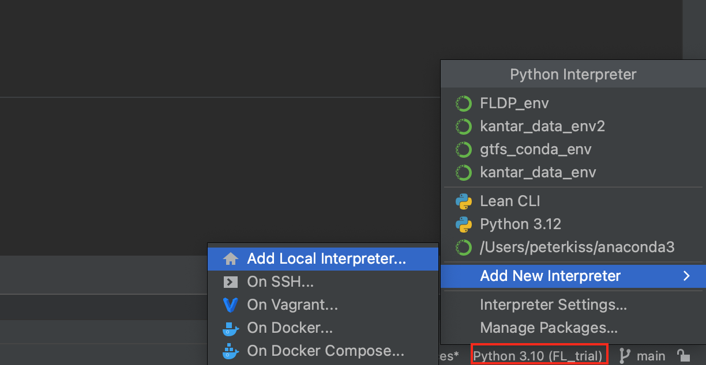
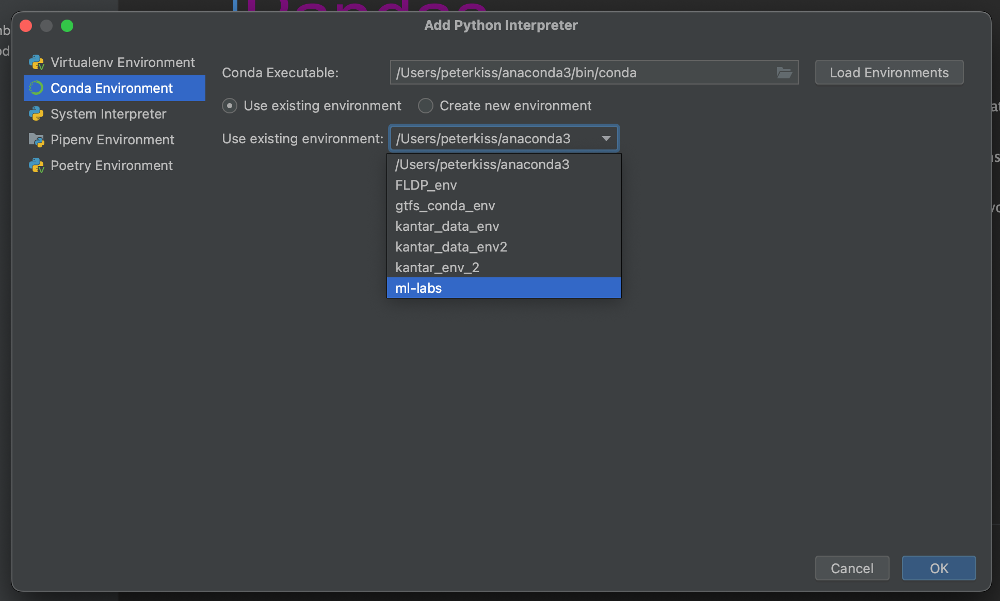

# ML practicals

This is the repository for ML practicals.

It is always recommended to create separate python environments for various projects, thus if you have to use different versions of packeges, your older codes will not brake.

I recommend to use [conda](https://conda.io/projects/conda/en/latest/user-guide/tasks/manage-environments.html#activating-an-environment) environments for our jupyter notebooks, but neturally the coice if yours.

## Setup a conda env and make it available to ipython

If you want to create an environment from scratch, that can be used in notebooks([Source](https://medium.com/@nrk25693/how-to-add-your-conda-environment-to-your-jupyter-notebook-in-just-4-steps-abeab8b8d084))
```
conda create --name ml-labs
conda activate ml-labs
conda install -c anaconda ipykernel
python -m ipykernel install --user --name=ml-labs
```

in pycharm then:






## Working with  ```environment.yml``` files:

### Exporting environment
If you already have an environment, which you would like to reproduce in another location, the canonical way is to export it into an ```environment.yml``` the following way:
```conda env export > envionment.yml```

The problem with this approach is, that the command will export all the packages that are installed in your environment, that is a lot of automatically downloaded dependencies, which may not exist for another platform (either there is no such package maintained on the platform, or just the given version is missing ).

There are two ways to solve this issues:
- containerize your local development environment 
- write you environment file by hand, only adding the packages, that you actually import.


### Recreating  environment from ```environment.yml```


```
conda env create -f environment.yml
```
after this you can add the same way to PyCharm as above. 

tlib pandas "pymc>=5"

### delete env:
```conda remove -n ml-labs --all```